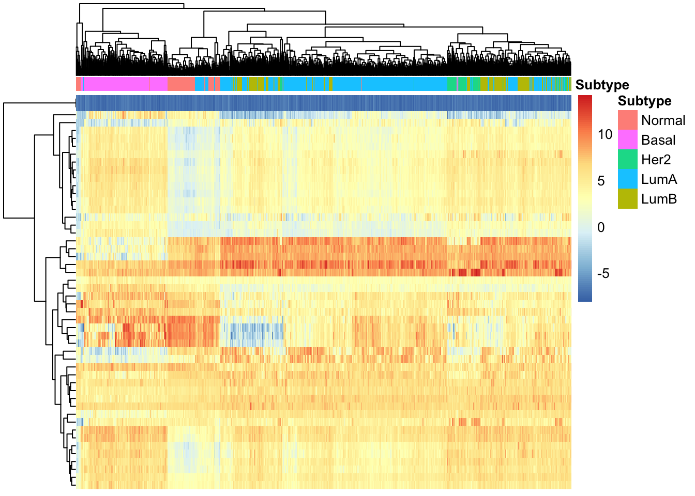

# Overview {-}

This document contains the final project for the "Introduction to RNA-Seq" module, part of the Bioinformatics and Statistics II class given at LCG-UNAM in February 2022. The original class material from [Dr. Leonardo Collado-Torres](http://lcolladotor.github.io/) can be found [here](https://lcolladotor.github.io/rnaseq_LCG-UNAM_2022/index.html). 

In this project, we will use the [`recount3`](http://rna.recount.bio) R package to download RNA-Seq data from The Cancer Genome Atlas project, obtaining all the BRCA samples. We will then evaluate the quality of the downloaded data, explore the available sample attributes, select a subset of these to build a statistical model, and perform differential expression analysis. 

.

## Requirements {-}

Install R 4.1.x from [CRAN](https://cran.r-project.org/) then install the following R packages:

```{r install, eval = FALSE}
## For installing Bioconductor packages
if (!requireNamespace("BiocManager", quietly = TRUE)) {
    install.packages("BiocManager")
}
## Install required packages
BiocManager::install(
    c(
        "usethis", ## Utilities
        "here",
        "biocthis",
        "lobstr",
        "sessioninfo",
        "SummarizedExperiment", ## Main containers / vis
        "iSEE",
        "edgeR", ## RNA-seq
        "limma",
        "recount3",
        "pheatmap", ## Visualization
        "ggplot2",
        "patchwork",
        "RColorBrewer", 
        "TCGAbiolinks"
    )
)
```


```{r session_packages, eval = TRUE, message = FALSE}
library("sessioninfo")

# To download data and generate RangedSummarizedExperiment data object  
library("recount3")

# To access data on tumor subtype 
library("TCGAbiolinks")

# To normalize counts
library("edgeR") 

# To plot results 
library("ggplot2")
library("pheatmap")

# For differential expression analysis
library("limma")
```

```{r session_info}
## Reproducibility information
options(width = 120)
session_info()
proc.time()
```
